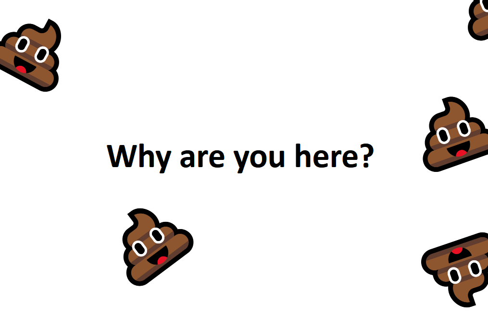

# flush.js - Simple emoji falling from the page top



# What?

This utility is aimed at providing useless functionality for your web pages and is used in [This project](https://pegasko.art/flush). The of this script is spawning multiple emoji objects falling from the top of the page to show that you can add this script to the page.

With this script you can simply attract user attention while eating up his CPU and GPU performance for nothing. Isn't it cool? Definitely.

# Howto

Simply add
```html
<script type="text/javascript" src="flush.js">
```
to your page and enjoy with `flushEmojee()` call supporting multiple customizations:
```javascript
function flushEmojee({duration=null, pps=1, size=1, fps=30, gravityY=1, baseSpeedY=10, baseSpeedX=10, emojee='💩', dimension='vmin'} = {});
```
where:
* `duration` - effect duration in seconds (default infinite)
* `pps` - particles per second spawn rate, based on `setInterval()` (default 1)
* `size` - particle size relative to vmin or vmax dimension of the page as set in `dimension` (default 30)
* `fps` - target rerender fps, based on throttling `requestAnimationFrame()` (default 30)
* `fravityY` - particle fall gravity value (default 1)
* `baseSpeedY` - base random y speed limitation for new particles, used to spadn moving particles instead of static (default 10)
* `baseSpeedX` - same as `baseSpeedY`, but for X coord
* `emojee` - emoji to spawn. By default uses emoji and square block containers for falling particles (default 💩)
* `dimension` - dimension to use: vmin or vmax (default vmin)

To create a stream of poo simply use:
```javascript
flushEmojee({
	duration: 13, 
	pps: 10, 
	size: 10, 
	fps: 30, 
	gravityY: 1, 
	baseSpeedY: 10, 
	baseSpeedX: 10, 
	emojee: '💩', 
	dimension: 'vmin'
})
```

# Demo

Demo is located in [demo.html](demo.html) or on [this page](https://pegasko.art/flush)

# License

```
flush.js - flush on the the page
Copyright (C) 2022  bitrate16

This program is free software: you can redistribute it and/or modify
it under the terms of the GNU General Public License as published by
the Free Software Foundation, either version 3 of the License, or
(at your option) any later version.

This program is distributed in the hope that it will be useful,
but WITHOUT ANY WARRANTY; without even the implied warranty of
MERCHANTABILITY or FITNESS FOR A PARTICULAR PURPOSE.  See the
GNU General Public License for more details.

You should have received a copy of the GNU General Public License
along with this program.  If not, see <https://www.gnu.org/licenses/>.
```